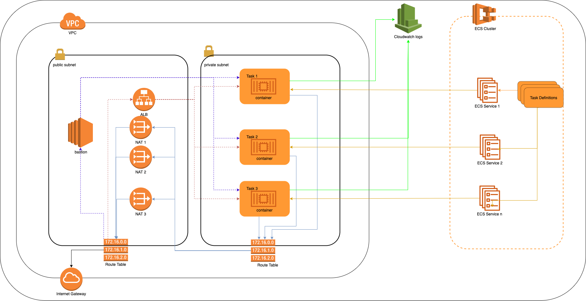

# aws-ecs-terraform
[](https://app.circleci.com/pipelines/github/jumal-ali/aws-ecs-terraform)

Build an ECS Cluster with a set of running ECS Services

## Architecture



## Prerequisite

- terraform
- aws-cli
- Access to AWS S3 Bucket to store/retrieve the statefile 

> _Note:_ to run this on another environment, please remove or update the `backend.tf` file

## Install terraform

Install *tfenv*: https://github.com/tfutils/tfenv (a version management tool for Terraform)

Then run the following commands

```sh
cd /repo/path
tfenv install
tfenv use
```

## Install aws-cli

https://docs.aws.amazon.com/cli/latest/userguide/install-cliv2.html

## Required Variables

    aws-region      = string
    project-name    = string
    env             = string
    vpc-cidr        = string
    azs             = [string]
    private_subnets = [string]
    public_subnets  = [string]
    create-bastion  = bool
    ssh-public-key  = string
    containers = [{
        image                = string
        tag                  = string
        container-port       = number
        host-port            = number
        cpu                  = number
        memory               = number
        app-name             = string
        healthcheck-commands = [string]
     },...]

> _Example:_ [./environments/dev.tfvars](./environments/dev.tfvars)

## Build/Update the infrastructure

```sh
terraform init
terraform apply --var-file ./path/to/variables.tfvars
```

## Validate code changes

```sh
terraform validate
```

## Format code changes

```sh
terraform fmt
```

## Decomission

```sh
terrform destroy
```
